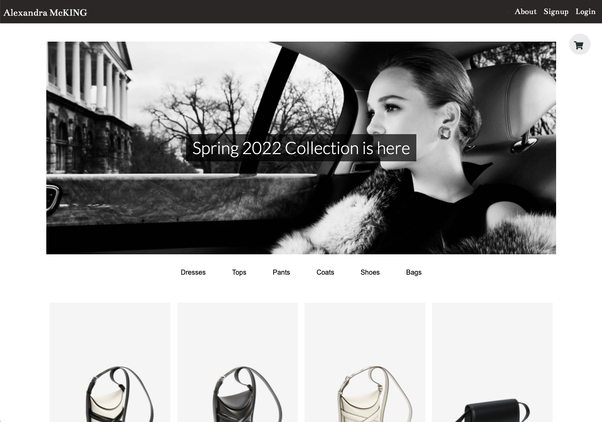

# Alexandra McKING | Luxury Fashion

## Description

Our shop is an high-end fashion shop that caters to the luxury consumer that is looking for the latest fashion trends.

---

## Table of Contents

- [Links](#links)
- [Tech Used](#tech-used)
- [Credit](#credit)
- [Questions](#questions)
- [License](#license)

---

## Links

- [Deployed App - Heroku](https://alexandra-mcking-shop.herokuapp.com)
- [Github Repo](https://github.com/mjos7/high-end-fashion-shop)

---

## Tech Used

- CSS
- Javascript
- GraphQL
- MongoDB / Mongoose
- Express
- React
- Node
- Jest
- JWT (JSON Web Token) for user authentication

---

## Credit

- [Catherine H](https://github.com/cat-bh)
- [Mark Joseph](https://github.com/mjos7)
- [MinhHa Pham](https://github.com/minhhap)
- [Hannah Roddy](https://github.com/hroddy)

---

## Questions

Please don't hesitate to reach out if you have any suggestions or feedback

---

## License

This app is licensed under the MIT license.
